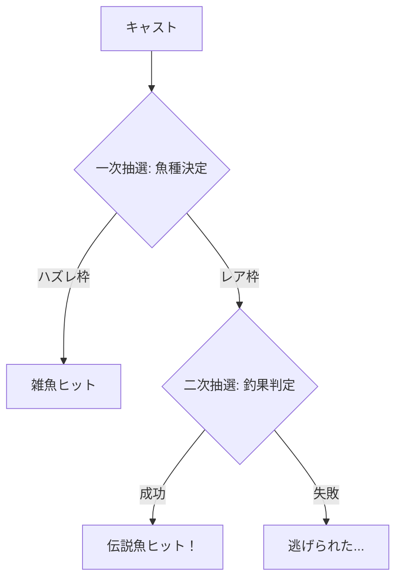

# 伝説魚の釣果率と再抽選

## 概要
FF14の漁師コンテンツにおける「伝説魚」は、特定条件下でしか釣れないレア魚種。釣果率に影響する「再抽選プロセス」の仕組みと、GP消費スキルによる確率操作の影響度を検証した。

## 再抽選プロセスとは

## 検証条件

| 項目 | 設定 |
|---|---|
| 対象魚 | *(ダミー: 紅龍)* |
| GP | 最大900 |
| 使用スキル | ペーシェンス2 + プレシジョンフッキング |
| 試行回数 | *(要データ)* |

## 結果
*(検証データが揃い次第追記)*

## 考察
- ペーシェンス2は二次抽選の成功率を大幅に引き上げる
- GPの使い方次第で、同じ時間での期待値が2〜3倍変動する可能性がある

---
*最終更新: 2026-03-04（ドラフト）*
