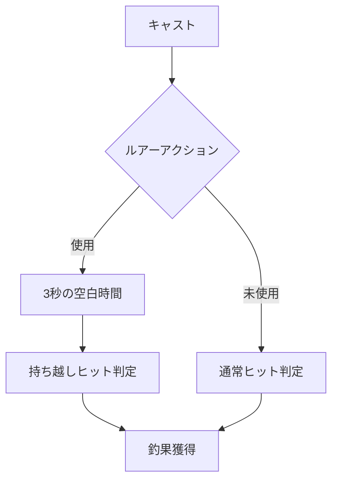

# デザインサンプル1：強調と空間の調整

このサンプルでは、**見出し前後の余白（行間）をHTMLタグで強制的に広げ**、さらに**見出しのレベル感を視覚的に強調**する手法を試しています。

---

## 1. 工程のフロー（Mermaid図）

 

## 2. 数式の独立性の確保（ブロック配置）

数式は単独の行として配置し、前後に空行を入れることで独立性を高めています。

$$ E[T] = \int_{t_{min}}^{t_{b}} t_{b} f(t) dt + \int_{t_{b}}^{t_{max}} t f(t) dt $$

このように配置すると、Chirpy環境でも数式が埋もれず、一つの「図」として認識しやすくなります。

 

---

 

### 3. 見出しの区別（中見出し）

見出しの上下に ` ` を入れたり、水平線（`---`）を多用することで、情報の境界を明確にしています。

#### 3.1 小見出しのテスト
このように、階層が深くなっても「前の段落との距離」を保つことで、読みやすさを維持します。

> **デザインポイント**
> - ` ` タグによる物理的なスペースの確保。
> - 水平線によるセクション分け。
> - 数式の独立性を `$$` の空行で確保。
