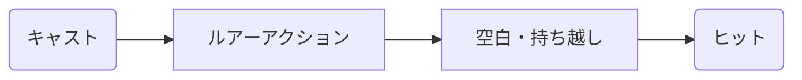

# デザインサンプル2：境界線とボックスの活用

このサンプルでは、**引用ブロック (`>`) やコードブロックを「枠線」として利用**し、情報の境界を物理的に区切ります。

---

## 1. 全体フロー

---

## 2. 数式モデルの定義

情報の境界をはっきりさせるため、定義などの重要な要素を引用ブロックの中に閉じ込めています。

> ### 期待値計算式
> 
> $$ E[T] = t_{b} \frac{t_{b} - t_{min}}{t_{max} - t_{min}} + \frac{t_{max}^2 - t_{b}^2}{2(t_{max} - t_{min})} $$
> 
> ※引用ブロックを活用することで、背景色や左端の線が「境界」として機能します。

---

## 3. 折り返しの視覚的調整

本文の折り返しを意識させるため、あえてリスト形式を多用し、一行の文字数を制御する書き方を試しています。

- **最小待機時間 ($t_{min}$)**
    - 基本仕様に基づき設定される最短の時間。
- **最大待機時間 ($t_{max}$)**
    - 魚の種類ごとに設定される上限の時間。
- **空白時間 ($t_{b}$)**
    - アクションによって発生するロックアウト。

このように、「項目：説明」の形に分解することで、横長にならずにスキャンしやすくなります。
