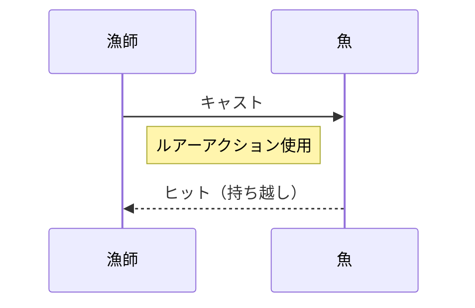

# デザインサンプル3：コンパクト化と早めの折り返し

このサンプルでは、**サイドバーや2カラム構成のような見た目を意識し、早めの改行や表による情報の「型化」**を試しています。

---

## 1. 簡易フロー図

---

## 2. 数式の提示（中央揃え強調）

Jekyll/Chirpyでは数式を `$$` で囲むと独立した行になります。ここではその前後に解説を挟み、視線を中央に集めます。

【 導出された期待値モデル 】

$$ E[T] = \frac{2t_{b}(t_{b} - t_{min}) + t_{max}^2 - t_{b}^2}{2(t_{max} - t_{min})} $$

【 モデルの適用結果 】

---

## 3. 表形式による情報の圧縮（折り返し対策）

長い文章を書くと視線が横に流れてしまうため、情報を表に押し込み、あえて「狭い範囲」で読ませます。

| パラメータ | 役割 | 備考 |
| :--- | :--- | :--- |
| **$t_{min}$** | 開始点 | 5秒〜 |
| **$t_{max}$** | 終了点 | 〜15秒 |
| **$t_{b}$** | ロック | 10秒地点 |

 

## 4. 結論
このように、物理的な改行位置を固定しなくても、**「リスト」「引用」「表」をパズルのように組み合わせる**ことで、視覚的な情報の密度を上げ、境界をはっきりさせることができます。
